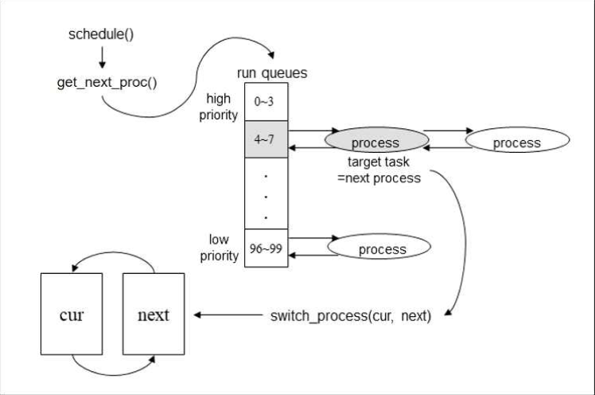

# OS_Scheduling

[CAUTION]

If you want to execute this source code on your computer, you have to run this software on 32bit Ubuntu Linux 16.04.
In addition, I'm not a native English speaker,so please consider it when you read this script. :)

[COPYRIGHT]

All copyright is belong to Soongsil University OS Lab and this project was fourth subject of OS class.

[OVERVIEW]

The main object of this project is to fill the code which needs to use scheduling algorithm in the original files given.
The principles of the scheduling algorithm are like below.

1. The priority of process must exist in between 0 to 99.

2. The first process called 'idle' must call the 'scheduling' function.

3. We should make a code not to increase the tick of all processes while context switching.

The above image shows us how the SSUOS scheduler works. The procedures of the scheduling algorithm can be arranged like below.

     1. The first process called 'idle' picks the next process to schedule up through calling schedule() and does 'conext 
     switching'.
     
     2. The other processes except the 'idle' process are switched to 'idle' process through calling schedule().

     3. The smaller priority value the process has, The bigger executing priority the process will get.

     4. 'Starvation' may be occured because the higher priority process will always be executed first.

     5. Each element of 'run queue' includes 4 processes.

     6. The scheduler will find next process to be executed by searching on 'run queue'.

     7. If the executing process requests the I/O, the OS has to change the status of the process and call 'schedule()'.

     8. The process waiting for I/O will not be scheduled.

     9. While context switching, the processes except 'idle' process have to maintain 'tick' value.
